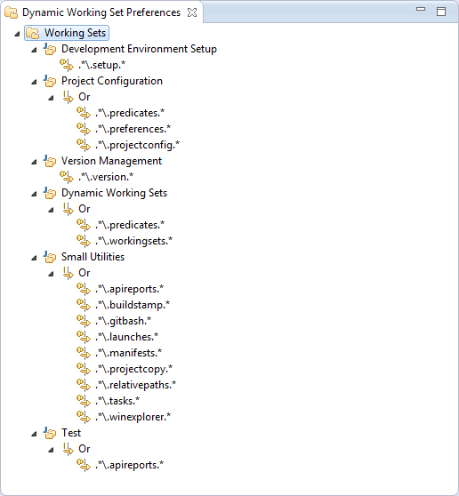
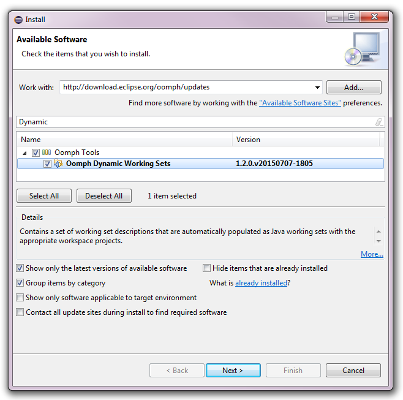

# Dynamic Working Sets

Dynamic working sets is another way to define working sets.
Instead of clicking together the projects belonging to a working set, the working sets are defined with a set of rules.
For example you can define that projects will belong to a working set if their name matches a specific pattern.
In addition to the name,
it is possible to define predicate that work on the project nature,
on the project builder,
on the presence of a specific file with a specific content.
There is also a set of logical operator predicates (and, or, not) to combine different predicates together.

Dynamic working sets can be used as part of the Oomph's [setup tasks](Authoring_Guide.md) or stand alone.

## Download/Installation

The easiest way to install the "Dynamic working sets" feature is to use the Oomph update site.

Copy the composite update site URL corresponding to the version you want to install from the [http://download.eclipse.org/oomph/updates](http://download.eclipse.org/oomph/updates).
To find the correct feature you can add the filter `Dynamic working sets`.

## User manual

You can define your dynamic working sets in the preferences: `Oomph > Dynamic Working Sets`.
Click on the `Edit...` button.

### Predicates

* Exclusion/Inclusion predicate
* Name predicate
* Repository predicate
* Nature predicate
* Builder predicate
* File predicate

Logical operators:

* And predicate
* Or predicate
* Not predicate 
