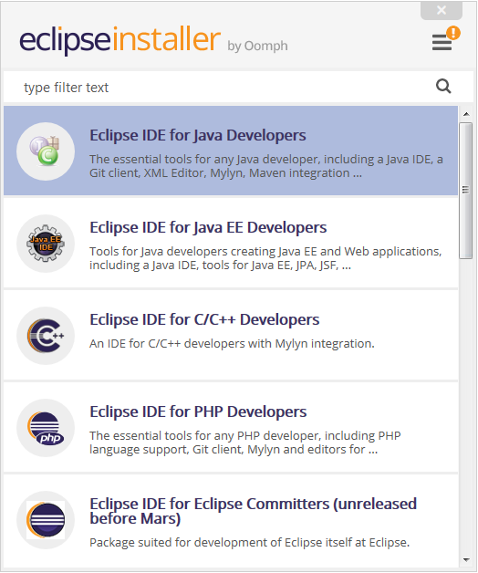

# Eclipse Installer

The Eclipse Installer automates the installation of Eclipse development environments.

See the [Authoring Guide](Authoring_Guide.md) for details about how to customize the installer to create installations and provision workspaces for your specialized needs.

# Milestone Installers

The following table provides milestone installers with an embedded JRE that install based on [Oomph milestone builds](index.md#update-sites):

| **OS** | **aarch64** | **riscv64** | **x86**
|---|---|---|---|
|macOS| [.dmg](https://www.eclipse.org/downloads/download.php?file=/oomph/products/eclipse-inst-jre-mac-aarch64.dmg) / [.tar.gz](https://www.eclipse.org/downloads/download.php?file=/oomph/products/eclipse-inst-jre-mac-aarch64.tar.gz)  | - | [.dmg](https://www.eclipse.org/downloads/download.php?file=/oomph/products/eclipse-inst-jre-mac64.dmg) / [.tar.gz](https://www.eclipse.org/downloads/download.php?file=/oomph/products/eclipse-inst-jre-mac64.tar.gz) |
|Linux| [.tar.gz](https://www.eclipse.org/downloads/download.php?file=/oomph/products/eclipse-inst-jre-linux-aarch64.tar.gz) | [.tar.gz](https://www.eclipse.org/downloads/download.php?file=/oomph/products/eclipse-inst-jre-linux-riscv64.tar.gz) | [.tar.gz](https://www.eclipse.org/downloads/download.php?file=/oomph/products/eclipse-inst-jre-linux64.tar.gz) |
|Windows| [.exe](https://www.eclipse.org/downloads/download.php?file=/oomph/products/eclipse-inst-jre-win-aarch64.exe) / [.zip](https://www.eclipse.org/downloads/download.php?file=/oomph/products/eclipse-inst-jre-win-aarch64.zip) | - |  [.exe](https://www.eclipse.org/downloads/download.php?file=/oomph/products/eclipse-inst-jre-win64.exe) / [.zip](https://www.eclipse.org/downloads/download.php?file=/oomph/products/eclipse-jre-inst-win64.zip) |

# Nightly Installers

The following table provides nightly installers with an embedded JRE that install based on [Oomph nightly builds](index.md#update-sites):

| **OS** | **aarch64** | **riscv64** | **x86**
|---|---|---|---|
|macOS| [.dmg](https://www.eclipse.org/downloads/download.php?file=/oomph/products/latest/eclipse-inst-jre-mac-aarch64.dmg) / [.tar.gz](https://www.eclipse.org/downloads/download.php?file=/oomph/products/latest/eclipse-inst-jre-mac-aarch64.tar.gz)  | - | [.dmg](https://www.eclipse.org/downloads/download.php?file=/oomph/products/latest/eclipse-inst-jre-mac64.dmg) / [.tar.gz](https://www.eclipse.org/downloads/download.php?file=/oomph/products/latest/eclipse-inst-jre-mac64.tar.gz) |
|Linux| [.tar.gz](https://www.eclipse.org/downloads/download.php?file=/oomph/products/latest/eclipse-inst-jre-linux-aarch64.tar.gz) | [.tar.gz](https://www.eclipse.org/downloads/download.php?file=/oomph/products/latest/eclipse-inst-jre-linux-riscv64.tar.gz) | [.tar.gz](https://www.eclipse.org/downloads/download.php?file=/oomph/products/latest/eclipse-inst-jre-linux64.tar.gz) |
|Windows| [.exe](https://www.eclipse.org/downloads/download.php?file=/oomph/products/latest/eclipse-inst-jre-win-aarch64.exe) / [.zip](https://www.eclipse.org/downloads/download.php?file=/oomph/products/latest/eclipse-inst-jre-win-aarch64.zip) | - |  [.exe](https://www.eclipse.org/downloads/download.php?file=/oomph/products/latest/eclipse-inst-jre-win64.exe) / [.zip](https://www.eclipse.org/downloads/download.php?file=/oomph/products/latest/eclipse-jre-inst-win64.zip) |
