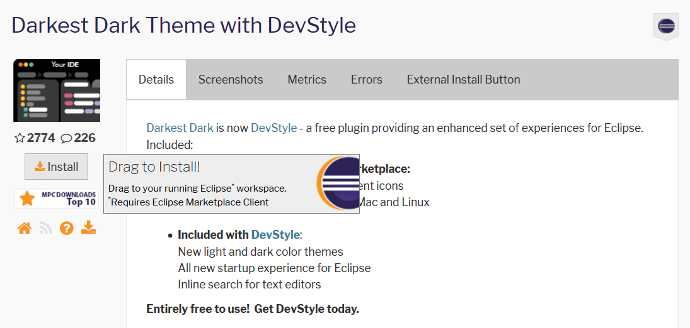
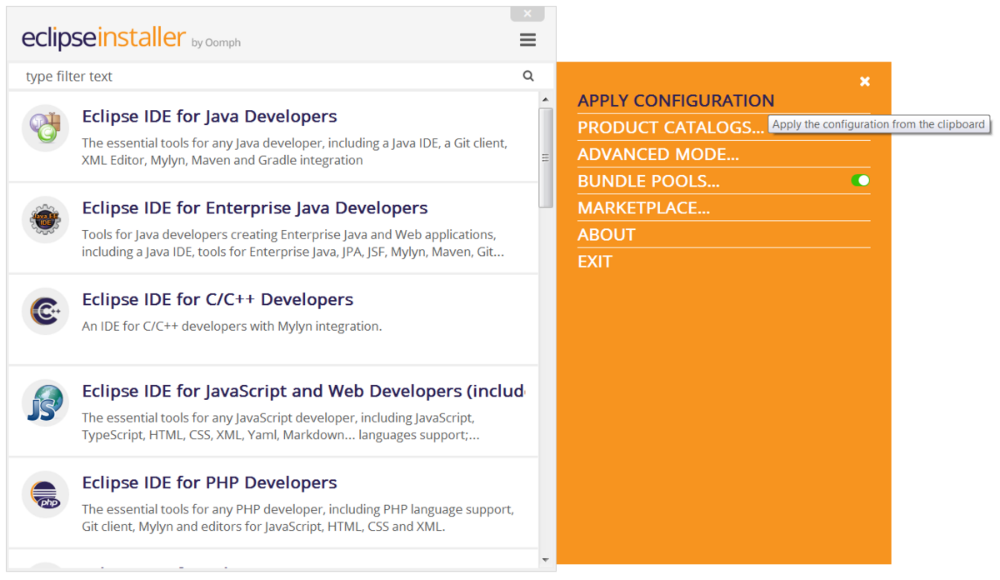
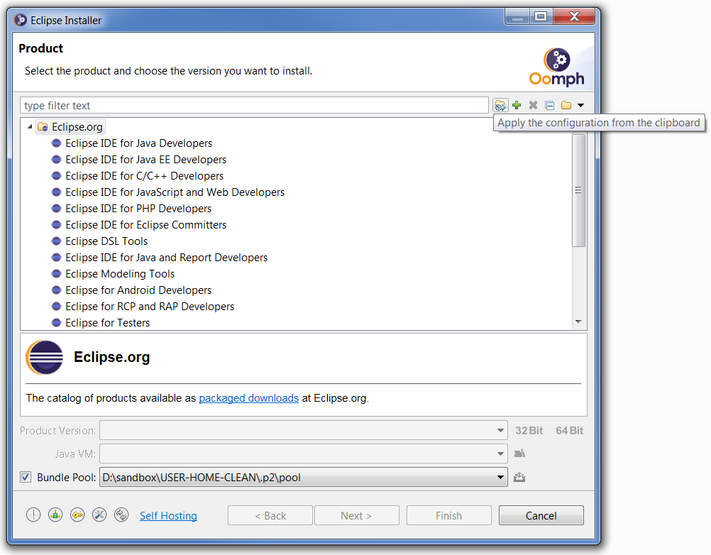
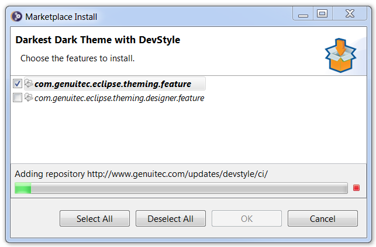
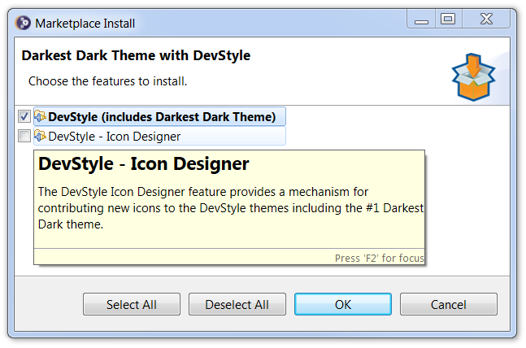

# Eclipse Installer for Marketplace

This page provides step-by-step instructions for how to use the [Eclipse Installer](Eclipse_Installer.md) to install [Marketplace](https://marketplace.eclipse.org/) listings.

If you encounter problems or have suggestions for improvements,
please use [issues](https://github.com/eclipse-oomph/oomph/issues) for that purpose.

# Launch the Eclipse Installer

If you don't already have the Eclipse Installer on your system,
[download](Eclipse_Installer.md) the installer that is appropriate for your operating system's architecture.
For Windows, the installer is distributed as a self-extracting executable.
For Mac and Linux, you must unpack the installer before you can run the application.

Now launch the installer application.
Unless you just downloaded a new installer, the one you have probably needs to be updated.
In simple mode, you'll see a `!` indicator on the menu button in the upper right corner;
the menu will have an update item to start an update:

In advanced mode, the right-most toolbar button at the bottom can be pressed to start an update.

Note that the installer will by default use a shared bundle pool for creating installations.
This defaults to the .p2 folder in the home folder.
If the file system for the home folder is relatively small,
you can change the default location using the `Bundle Pools` menu option in simple mode,
or the right-most toolbar button in the Bundle Pool section in advanced mode,
as seen in each of the corresponding screen captures in the following section.

Note also that you can choose which Java VM is used by the installation you are about to create.
The installer will generally detected the JREs and JDKs installed on your system,
choosing an appropriate default,
and remembering it for the next time you use the installer.
But failing that, the installer will stay on the product page and you must use the tool button to locate a Java VM that is suitable for the installation being created.

# Apply a Marketplace Listing

Open the [Marketplace](https://marketplace.eclipse.org/) web page and use it to locate the listing you wish to install,
e.g., [Darkest Dark Theme with DevStyle](https://marketplace.eclipse.org/content/darkest-dark-theme-devstyle).
Each listing has an Install icon that you can drag from the browser and drop onto the title area of the installer.

You can even drag and drop the URL of the listing itself,
so, as an example, you can drag and drop [this link](https://marketplace.eclipse.org/content/darkest-dark-theme-devstyle).

As an alternative to drag-and-drop, you can copy the link and apply it to the installer.
In simple mode, this is done via the menu action;
this action will appear in the menu only if the clipboard contains a valid Marketplace listing:

Note that the menu has a convenient link for opening the Marketplace in
your favorite browser.

In simple mode, this is done via the left-most button in the toolbar;
this button will appear in the toolbar only if the clipboard contains a
valid Marketplace listing:

After dropping the link or applying the link, the Marketplace Install
dialog will appear.

# Configure a Marketplace Listing

Initially the OK button will be disabled while the p2 repository loads.
At this point, only the installable units IDs are available and displayed.

When the repository is loaded, the detailed information becomes available and the OK button will be enabled.

You can hover over each feature to see its description.
Note that the features in bold are so-called required features so you cannot deselect them.

You can of course add multiple listings to the installer before proceeding with the installation of your selected product.
The Marketplace is full of goodies\!
