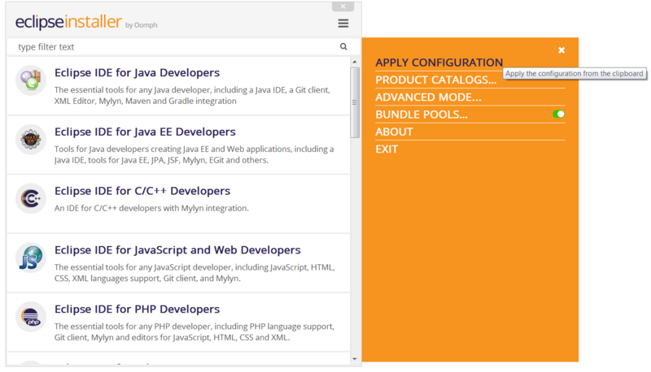
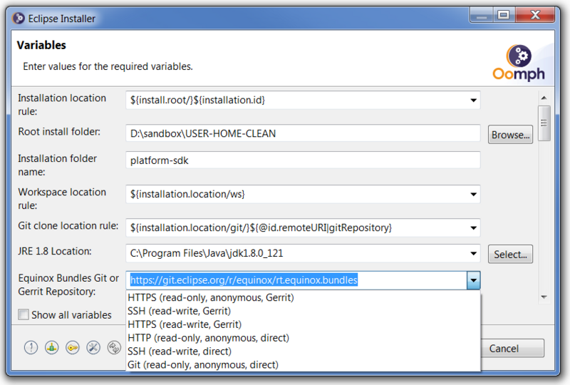
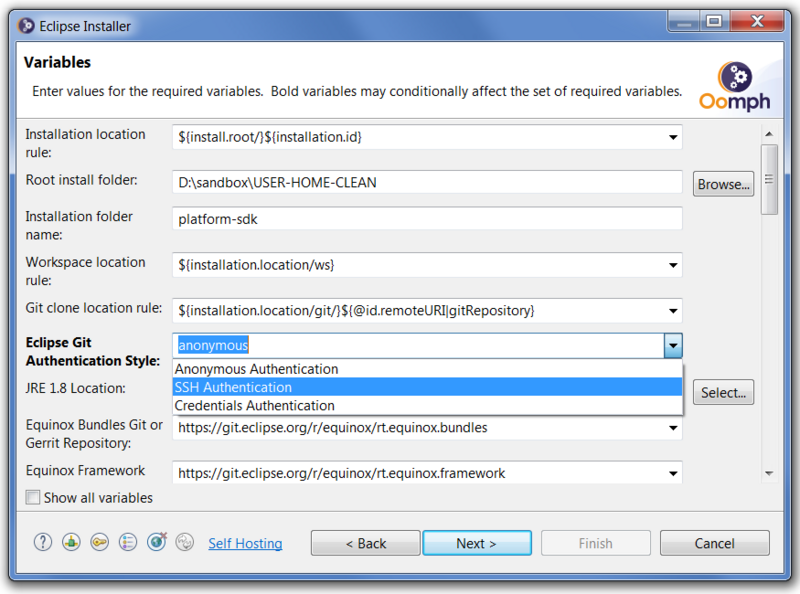
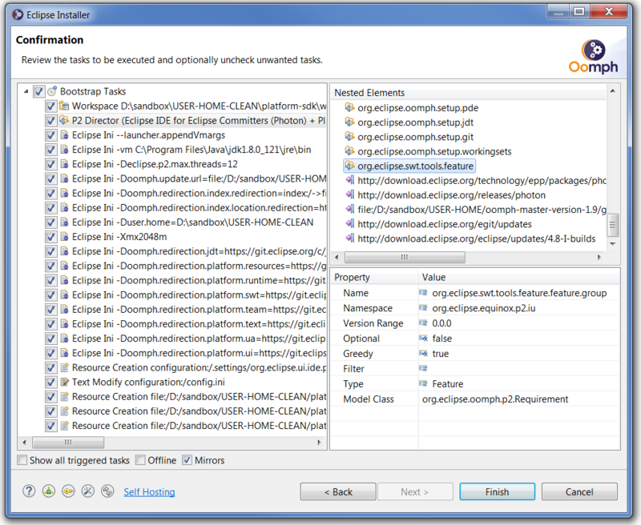
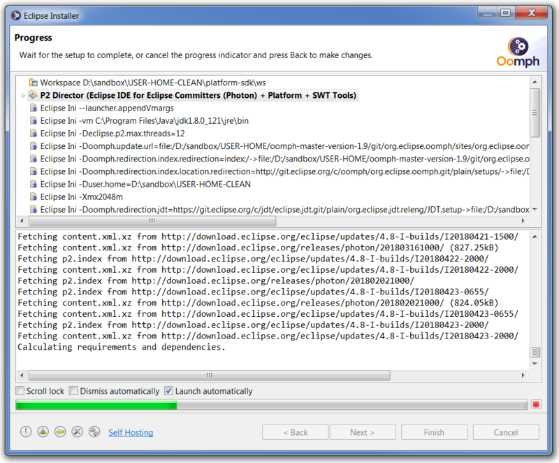
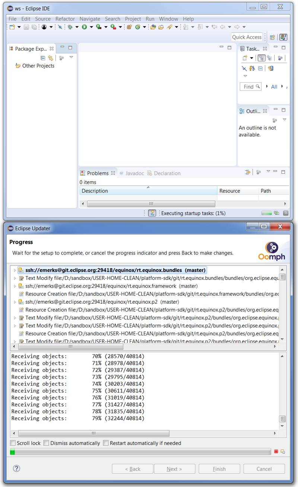
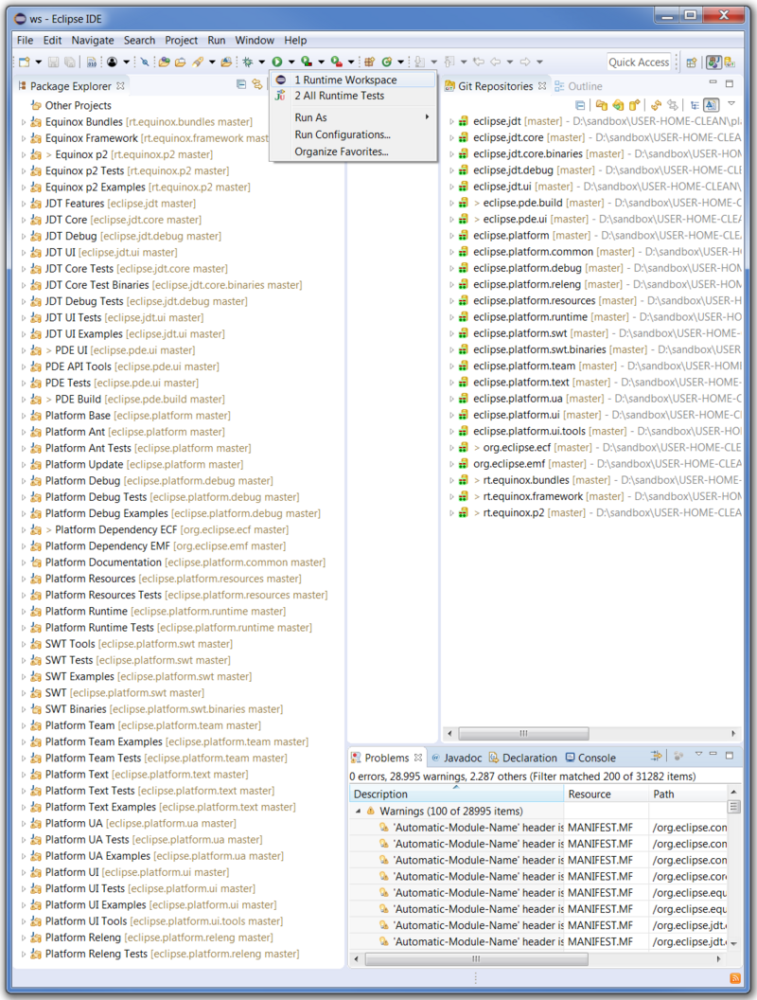
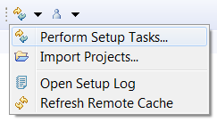
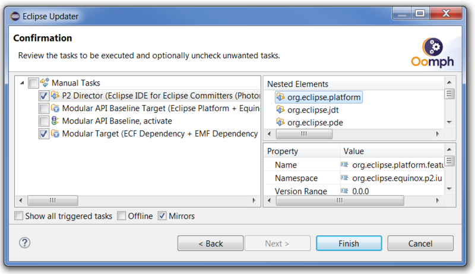
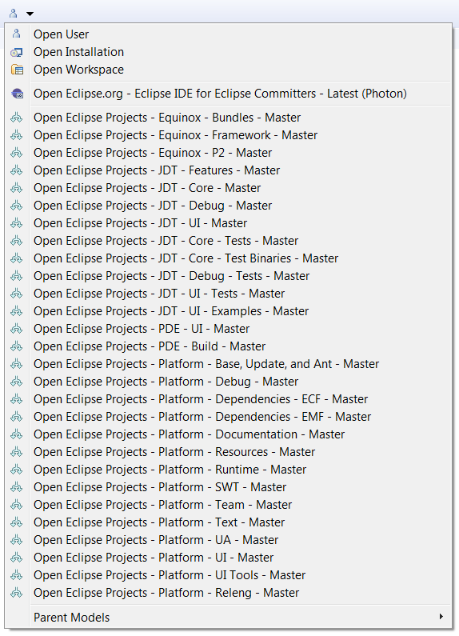

# Eclipse Platform SDK Provisioning

This page provides step-by-step instructions for how to provision a dedicated development environment
for the complete set of projects that comprise the [Eclipse Platform's SDK](https://eclipse.dev/eclipse/),
i.e., the projects used to build the [downloads](http://download.eclipse.org/eclipse/downloads/) of the Eclipse Platform Project.
The provisioning process is entirely automated, except for course from user input to choose configurable options,
e.g., where in the file system to place the installation,
but even for these, defaults are provided.

If you encounter problems or have suggestions for improvements,
please use [issues](https://github.com/eclipse-oomph/oomph/issues) for that purpose.

## Launch the Eclipse Installer

If you don't already have the [Eclipse Installer](Eclipse_Installer.md) on your system,
[download](Eclipse_Installer.md#nightly-installers) the installer that is appropriate for your operating system's architecture.
You will generally need to [install a JDK](https://adoptium.net/) to work with Eclipse projects which of course are written in Java,
so best to install the latest Long Term Support version that before getting started:

 * https://adoptium.net/

The latest version if the installer can be registered to automatically launch when clicking on a hyperlink.
This can be used to further automate the initial steps in this tutorial.
As such, you can open
[this link](https://www.eclipse.org/setups/installer/?url=https://raw.githubusercontent.com/eclipse-platform/eclipse.platform.releng.aggregator/master/oomph/PlatformSDKConfiguration.setup&show=true)
in a new tab to configure the installer to launch automatically.

Now launch the installer application.
Unless you just downloaded a new installer,
the one you have probably needs to be updated.
In simple mode, you'll see a `!` indicator on the menu button in the upper right corner;
the menu will have an update item to start an update:

In advanced mode, the right-most toolbar button at the bottom can be pressed to start an update.

Note that the installer will by default use a shared bundle pool for creating installations.
This defaults to the `.p2` folder in the home folder.
If the file system for the home folder is relatively small,
you can change the default location using the `Bundle Pools` menu option in simple mode,
or the right-most toolbar button in the `Bundle Pool` section in advanced mode,
as seen in each of the corresponding screen captures in the following section.

Note also that you can choose which Java VM is used by the installation you are about to create.
The installer will generally detected the JREs and JDKs installed on your system,
choosing an appropriate default,
and remembering it for the next time you use the installer.
But failing that, the installer will stay on the product page and you must use the tool button to locate a Java VM that is suitable for the installation being created.

## Apply the Platform SDK Configuration

We will use a so-called Oomph [configuration](Authoring_Guide.md#automation-and-specialization-with-configurations) to automate the selection of the product and projects to provision.

If you've registered the installer to launch automatically for links with scheme `eclipse+install` as described in the previous section,
you can open
[this link](https://www.eclipse.org/setups/installer/?url=https://raw.githubusercontent.com/eclipse-platform/eclipse.platform.releng.aggregator/master/oomph/PlatformSDKConfiguration.setup&show=true)
in a new tab and click the `Launch...` button on that page.
Doing so automates the following equivalent alternative steps.

Drag and drop the
[Platform SDK Configuration](https://raw.githubusercontent.com/eclipse-platform/eclipse.platform.releng.aggregator/master/oomph/PlatformSDKConfiguration.setup)
link on the title area of the installer.
If the installer is in simple mode, it will ask to `Switch to Advanced Mode`; confirm that prompt.
When the configuration is successfully applied, the installer will be in advanced mode and will automatically turn to the Variables page.

NOTE: Drag and drop may not work reliably on Linux or macOS,
so please use the next approach if you are also facing this problem.

As an alternative to drag-and-drop,
you can copy the
[Platform SDK Configuration](https://raw.githubusercontent.com/eclipse-platform/eclipse.platform.releng.aggregator/master/oomph/PlatformSDKConfiguration.setup)
link, and apply it to the installer.
In simple mode, this is done via the menu action;
this action will appear in the menu only if the clipboard contains a valid configuration:

In advanced mode, this is done via the left-most button in the toolbar;
this button will appear in the toolbar only if the clipboard contains a valid configuration:

## Review the Variables

After applying the configuration, you'll be on the Variable page of the install wizard's advanced mode:

Of course you can use the `Back` button to review the selections that were made on the previous two pages,
i.e., on the Product page and the Projects page.
If this is the first time you've used the installer,
there will be large number of variables,
but all have suitable defaults.
Of particular note,
you may wish to change the `Root install folder` to a different location,
it defaults to your home folder,
keeping in mind that this location will use a significant amount of disk space.
The three so-called location rule variables,
for this tutorial's example scenario, will create the installation in 
`D:\sandbox\USER-HOME-CLEAN\platform-sdk\eclipse` (`Eclipse.app` on macOS),
the workspace in
`D:\sandbox\USER-HOME-CLEAN\platform-sdk\ws`,
and all the Git clones under
`D:\sandbox\USER-HOME-CLEAN\platform-sdk\git`.

The long list of variables is mostly the result of the different choices available for the URI used to clone each Git repository.
Previous there were six choices,
but that that is reduced to for GitHub-hosted projects.
All the clone URIs for the Platform SDK Configuration's repositories default to anonymous, read-only access.
If you are a committer on a project that allows direct push,  you will want to change each of these URIs to a form that allows read-write access;
the Eclipse Platform projects only accepts Pull Requests, so the defaults are appropriate.

Note that if you find it very painful to change each of the many URIs in the dialog,
you'll only ever have to do this once,
because the installer will remember this choice and will no longer display the variable,
unless you check `Show all variables`,
in which case you can change the choice you made previously.
In addition, the latest version of the installer has simplified these steps.
There is now the possibility for a prompted variable that you can exploit to change all the prompted clone URIs to use your preferred style of authentication.

Press the `Next` button.

## Confirm the Tasks

After pressing the `Next` button, you'll be on the Confirmation page:

Here you can see all the setup tasks that must be performed before the installation can be launched.
You can select each task to review its nested element structure and its properties;
you can also select a nested element to review its properties.
The most important task is the so-called p2 Director task;
it specifies the requirements of what needs to be installed and the update sites from which to install them.
Note in particular that the Platform SDK Configuration will install using the Eclipse Platform Project's most recent Integration build.

Press the Finish button and accept the license that is likely associated with the features you are about to install.

## Monitor the Progress

After pressing the `Finish` button, you'll be on the Progress page where you can review the progress of the tasks being performed.

After the p2 Director task's repositories are loaded, when it's time to download the artifacts to install, you'll likely be prompted to accept all the specific licenses.
Note that this confirmation dialog has a "Remember accepted licenses" check box;
be sure to click it so that you'll never be asked to review these licenses again.

If this is the first time you've created an installation using the installer you may wish to go for a quick coffee break while the artifacts download.
Be sure the `Launch automatically` check box is checked so that the installation will automatically be launched upon completion
(in case your coffee break turned out to be longer than expected).
Unfortunately the platform's integration build is not mirrored, and there are frequent new builds, so this process can take a while.
Also the `download.eclipse.org` server sometimes gets overloaded,
so if there is a timeout failure, you can press the `Back` button, followed by the `Finish` button, to resume downloading.

## Provision the Workspace

When you get back from your coffee break,
the installation will have launched and the setup engine will be working hard to provision its workspace.
Note that there will be an animated button at the bottom of the window, near the right-hand side.
You can press that control to bring up the Eclipse Updater dialog, so you can review the progress of provisioning the workspace:

There's nothing else you need to do.
Cloning all these repositories will definitely take some time, some are very large, and the update sites might be slow, so you can go on your lunch break now because this could take 90 minutes.

## Review the Result

The end result is a workspace like this:

All the projects are organized into sensible working sets.
The setup even created a feature-based "Runtime Workspace" launcher and added it to the favorites list, so it's already in the menu.
Now you can make changes to any project to fix bugs or to add new features and you can launch a runtime instance to test any of your changes.

Note that PDE's target platform for this workspace also contains binary equivalents of all projects in the workspace,
so you can close any combination of projects to improve build time without causing compile errors.

## Update the Installation and Workspace

Suppose you've performed these steps a few weeks ago and would like to update the installation and workspace to the latest and greatest state.
Of course you can easily select all Git repositories in the Git Repositories view and do a Pull.
But you can also easily update the installation and the workspace using the tool bar contributions provided by Oomph.
 The Perform Setup Tasks tool bar menu button is useful for this purpose:

It launches the Eclipse Updater.

The p2 Director task will update the installation with the latest Eclipse Platform integration build.
The Modular Target task will update the target platform with the latest dependencies;
it will even import new projects if there are any.
The API baseline changes rarely, i.e., only between releases, so you won't need to perform the tasks for updating the API baseline nearly as frequently.
Note that you can selectively enable tasks.
In the above I have only enabled the first and the last task.
It's very convenient to enable a single task with a double-click;
all other tasks will be unchecked and only the selected task will be checked.
Hitting `Finish` will perform the enabled tasks.
By default the dialog will minimize to the status bar, where it will be visible as an animated icon.
It's a non-modal dialog, so you can make it visible by clicking the status icon.
The status icon will eventually disappear if the tasks perform successfully;
if not, you'll need to open the dialog to see what's going on.
For example, when the installation is updated, you'll need to restart the IDE, which you can do by pressing the `Finish` button of the wizard.

You may also wish to view the setup definitions provided for the various projects.
The `Open setup` menu button is useful for this purpose:

Please refer to the [authoring guide](Authoring_Guide.md#understanding-the-setup-engine) if you're interested in the details.
Many of the project setups are located within the Git clones themselves, so you can contribute changes to them, and can test the impact in the running installation;
the long term goal is for each project to maintain its own project setup.
In any case, you might get some good ideas for how best to author an Oomph setup for your own projects! 
