# Repository Analyzer

Oomph's repository analyzer is an application for generating a detailed analysis report of one for more p2 repositories.
Oomph's [repository-analyzer job](https://ci.eclipse.org/oomph/job/repository-analyzer/) illustrates how to use this application to generate reports.
It currently generates [reports](https://download.eclipse.org/oomph/archive/reports/) for the the Eclipse Project's p2 update sites.

It is also use to generate a report for the aggregated components that are used to build the [Simultaneous Release](#simultaneous-release) repository.
And the [SimRel Repository Analyzer Test](https://ci.eclipse.org/simrel/job/simrel.oomph.repository-analyzer.test/) generates reports for release train repositories.

## Page Types

There are three general page types generated.

* Pages for folders that are not themselves p2 update sites; these are useful only for navigation.
* Pages for folders that represent a p2 update site with two variants:
  * Pages for composite update sites.
  * Pages for simple update sites.
* Pages for each installable unit in an update site.

## Update Site Pages

An update site page looks will appear as follows:

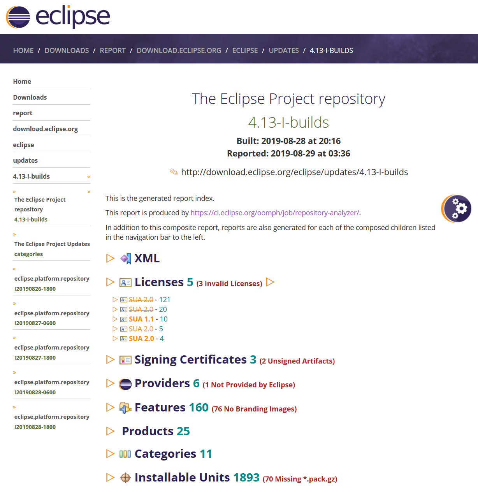

In this case, it is a page for a composite p2 repository, so an "XML" section is included For a simple p2 repository,
the detailed information about site's content
and artifacts is very large and is therefore provide via separate installable unit-specific pages.

In general, sections are expandable via the orange triangle.
Some sections support expand all via a second orange triangle after the section title,
which appears only after expanding the section itself.

The report will diagnose the specific problems as documented in the sections that follow.

### Composite Locations

These are shown only for composite sites.
If the composite site specifies a location using an absolute URI that has the same host as the composite site itself, this is reported as a problem:

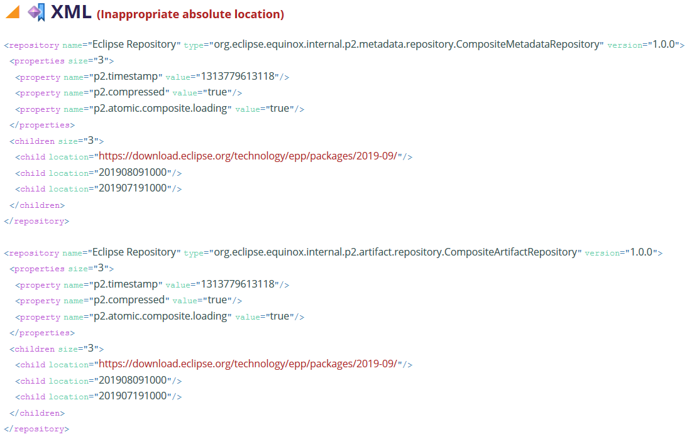

Such a design is problematic because it predetermines the scheme the user must use.
So a user with problems accessing Eclipse via http-scheme will not be able to load this composite via http-scheme because the composite specifies they must use https-scheme.
Also, it will not be possible, locally on the build server, to access this composite purely using file-scheme.

### Licenses

There are current 3 valid variants of the Eclipse Software User Agreement.
All features and products must use one of these three as their license.
Non-conformance is diagnosed as a problem. Detailed information is provided each license and for the installable units (features and products) that use each license.

Under the covers, p2 computes a fingerprint for each license.
This is displayed in report and this item can be expanded to show the full license text.
The license is matched against one of the 3 valid SUAs and the mismatch is highlighted to show what's wrong.

Here we see that some type of encoding problem has occurred;
the to-be-deleted text is shown in bold red and the to-be-added text is show in bold green,
in a really big font if the mismatch is small.

### Keys for PGP Signed Content

All content distributed from Eclipse must be signed by a valid certificate (as described in the next section) or by a PGP key:

The PGP key fingerprints are displayed and each section is expandable to list the installable units that are signed with that key.
The key fingerprint links to a key server with more details about the key.

### Certificates for Signed Content

All content distributed from Eclipse must be signed by a valid certificate, preferably a recent one.
Unsigned content is diagnosed as a problem and the offending installable units are list:

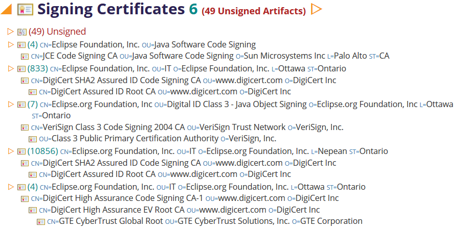

Certificate details are displayed and each section is expandable to list the installable units that are signed with that certificate.
Of course this also provides access to the list of unsigned installable units.

### Providers

All content distributed by Eclipse is provided by Eclipse.
Features specify the name of the provider and the branding guidelines dictate that Eclipse must always be part of every project's brand.
Any feature that is non-conformant will be diagnosed as a problem:

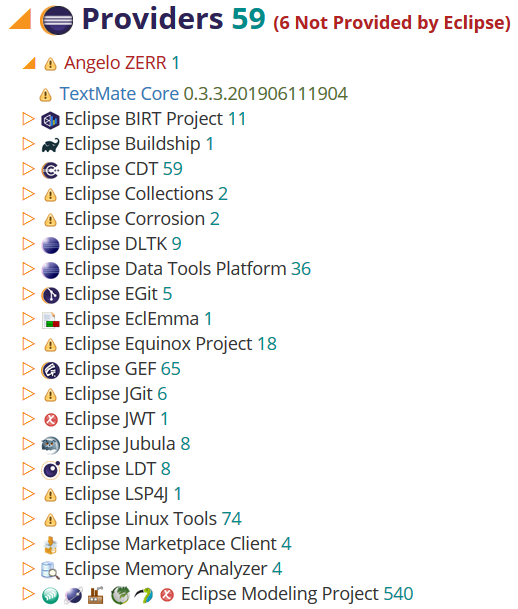

This summary also shows the associated branding image of each feature.
A warning icon indicates that no such image could be determined.
An error icon indicates that the feature specifies an image, but doesn't actually include the image in the feature's associated artifact.

### Bad Branding

Generally all features probably should be branded with an associated provider and a branding image.
The report includes a section for these details:

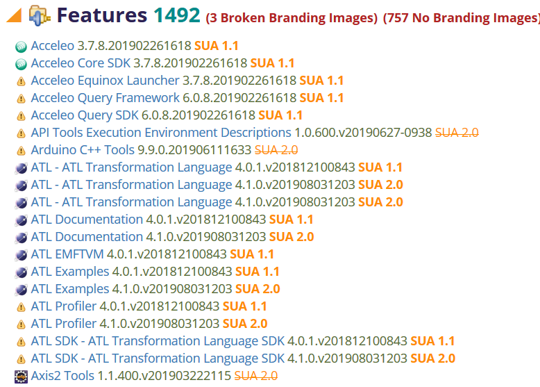

As mentioned previously, a warning icon indicates that no such image could be determined,
and an error icon indicates that the feature's branding plugin specifies an image,
but doesn't actually include the image in the branding plugin's associated artifact.
A feature's image is computed using the feature's ID to find a corresponding bundle with that same ID;
if such a bundle exists and it specifies the necessary `about.ini` details,
then it will appear in the dialog.

Note that the combination of provider name and branding image is what determines the images and grouping in the About Eclipse dialog.

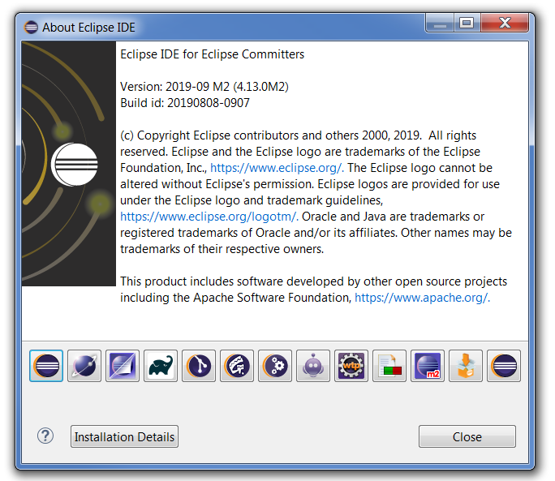

A feature that does not have a corresponding branding plugin with an about image will not induce a corresponding button on this dialog
nor will that feature appear grouped in any of the buttons on the About Dialog.

This is generally easy to fix if you have an existing branding plugin by modifying the feature.xml to add `plugin={branding-plugin-id}`
 to refer to a specify existing branding plugin with an ID different form the feature's ID.

### Products

In the long term, the repository analyzer should determine whether a product's native executables are properly signed.
Currently the report only lists the products.

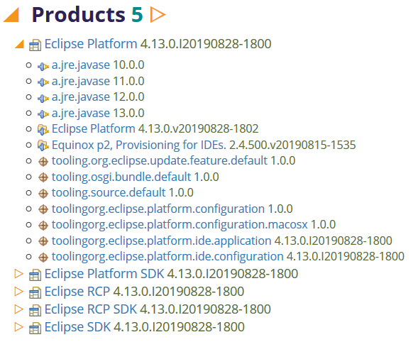

### Categories

The report will include a summary of all the categories.
These are of course the categories presented to the users when they install features.

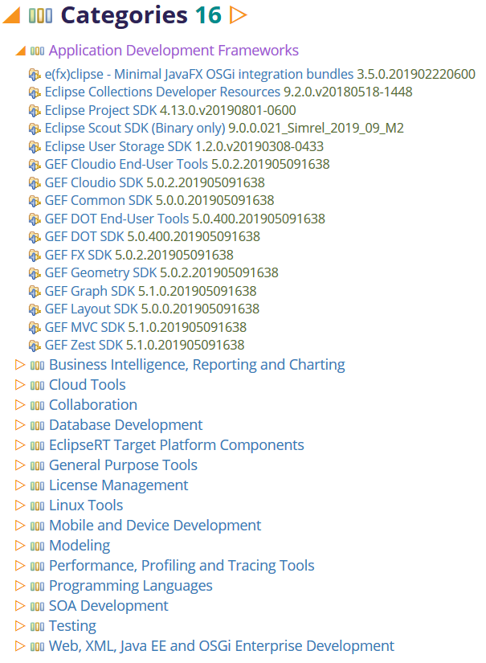

### Installable Units

The report will include details about each installable unit.
If there are units with artifacts with unsigned content or with missing pack200 artifacts, these will be diagnosed:

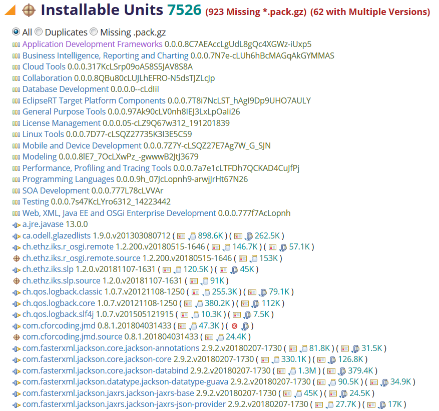

If there are such problems, filters are available to show only the installable units with those problems.
Details for each unit include the size of the associated artifact(s).

#### Installable Unit Filters

To make it easier to get a "project specific" overview, the installable units section supports pattern-based filtering along with more problem specific filters choices:

The Filter Pattern supports regular expressions and functions well in combination with the radio-button filters.
Here we look only at Sirius installable units and have filtered it to the the one(s) with broken branding images,
i.e., where the branding plugin specifies an image but the image is not present in the artifact,
likely not specified in the build.properties to be included in the binary bundle.

## Installable Unit Pages

Every installable unit displayed on the any of the Update Site pages is a link to an Installable Unit page.

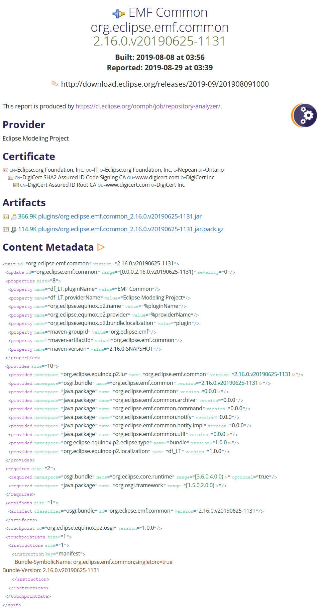

The summary title includes the name, the ID, the version, when this unit's repository was built, and which repository contains this unit.

Sections for the provider, the description, the certificates used for signing, and the associated artifacts are also provided.
The artifacts details are links to the actual artifacts such that you can down them.

Finally the full content metadata is displayed, including support for expand all.

### Installable Unit Content Metadata

In general, p2 knows only about installable units.
Bundles/plug-ins, features, products, and even categories are all represented as installable units.
All the relationships between these high level concepts, and details about these are captured in the XML.
The most interesting of these are the provided and the required elements.
In the end, p2 resolution involves hooking up these two relations,
i.e., at the root one has installable units that are required
and every transitive requirement then resolves to a provided capability of some installable unit.
The repository analyzer does a full analysis to determine all the provided capabilities that satisfy any given requirement,
and it maintains the inverse of this relationship.
These are then injected as navigable links in the XML,
again with the little orange triangles that can be used to expand those relationships and then navigate them.
So given any installable unit, you can determine all the other units that require it and all the units that it requires.

### Installable Unit Provided Capabilities

So for this unit we can see which features require it, which other bundles require it, and we can see that no bundle imports its exported packages.

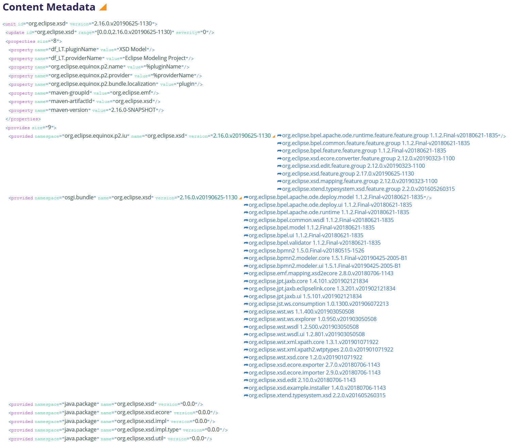

### Installable Unit Requirements

For same unit as the previous section, we can see that its requirements are minimal and which capabilities satisfy those requirements:

As mentioned, each of these details links to another (or even the same) Installable Unit page.
Moreover the link is anchored to the capability or requirement at the other the of the relationship;
this is highlighted in the target page.
I.e., navigating the first link in the above screen capture will navigate to a page that looks like this:

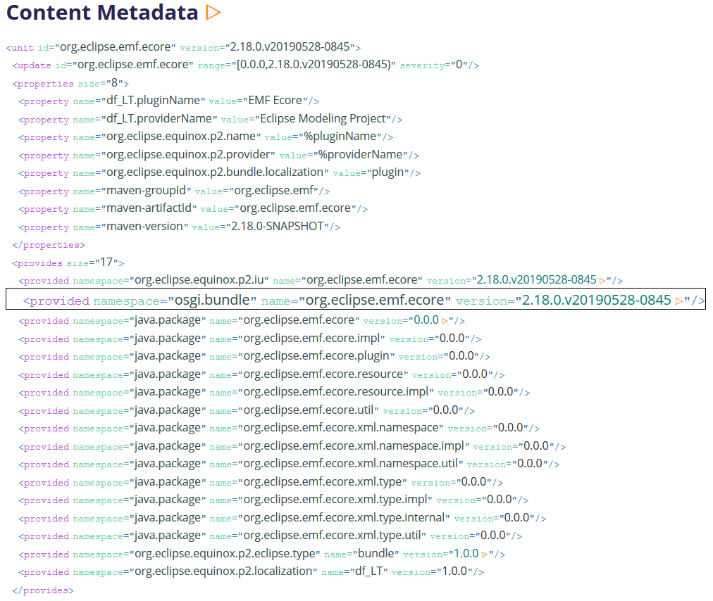

## Simultaneous Release

The repository analyzer also generates a [simrel report](https://download.eclipse.org/oomph/archive/simrel/) for the current [Simultaneous Release](https://github.com/eclipse-simrel).

The simultaneous release repository is aggregated from the [simrel.aggr](https://github.com/eclipse-simrel/simrel.build/blob/main/simrel.aggr) resource,
which contains references to a set of `*.aggrcon` resources.

The main index page's navigation lists each `*.aggrcon` resource and also lists each simple repository that is loaded curing the reporting process.
If there are serious problems contributed by that resource, an error icon appears before the resource's name:

Each `*.aggr` resource is logically interpreted as a composite repository, as seen in the XML section below.
As such, each simultaneous release train participant is provided with a report specific to their project's contribution to the release train.

The main report page for each `*.aggr` is filtered to the installable units that are actually contributed to the train repository.
In addition, a report is also generated for each repository of the `*.aggr`:

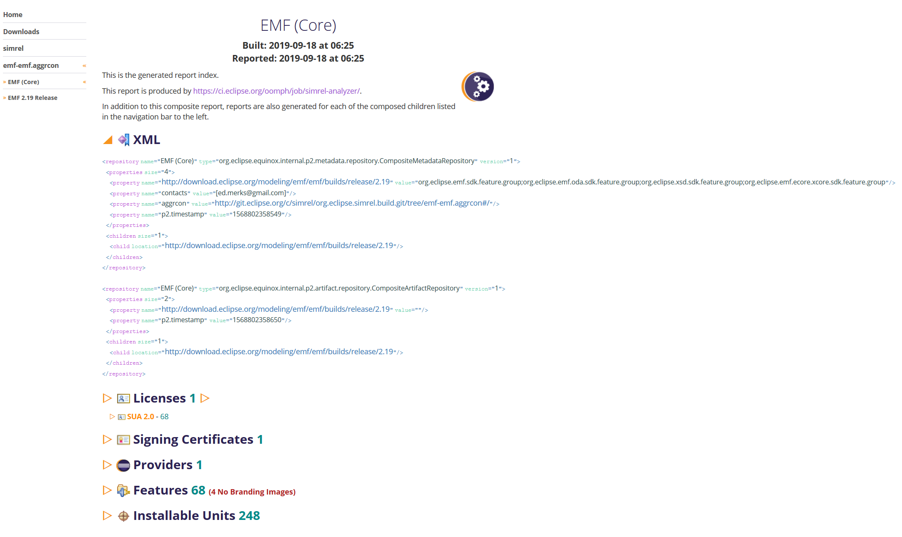
