# Targlets

Oomph's Targlet technology extends [PDE's](https://www.eclipse.org/pde/) base functionality for specifying a target platform definition by providing a more expressive, flexible, scalable, and reliable mechanism.
The Targlets framework is fully integrated with PDE;
it uses PDE's target location extension point, providing a Targlet Container implementation to augment PDE's built-in target location implementations.

As you'll see in the tutorial, here are some of the significant advantages of Oomph's Targlet Container versus PDE's Software Site container:

* Dependencies are expressed as Requirements versus as Installable Units.
  * A Targlet's Requirement can specify a version range, optionality, greediness, cardinality, filters, and so on.
    Any p2 namespace, such as `java.package`, can be specified, as well.
  * A PDE Software Site container's Installable Unit must specify either no version (omni-version) or an exact version.
* Dependencies of local projects in the file system, e.g., in a local Git clone, can be taken into account during resolution using a Source Locator.
  * A Targlet Container resolves the requirements from the combination of all local projects and all available software sites.
  * It can use wildcards to specify all available Requirements of the Source Locator.
  * It imports projects into the workspace as a side-effect of resolution.
* The resolution process supports roll-back on failure.
  * A resolution failure or network failure with Targlets will leave the old successful resolution in place.
  * A resolution failure with PDE's Software Site container will destroy your target platform,
    leaving all your workspace projects with errors until the problem is resolved,
    e.g., until your network or the hosting servers of the software sites are restored.
* Resolved artifacts use a shared bundle pool, which is highly significant when you have multiple workspace.
  * Targlet Containers will download and store each artifact once in the file system, sharing them across workspaces (and even sharing the artifacts used by your installations).
  * PDE resolves artifacts separately into a workspace-specific bundle pool, resulting in many duplicates (and downloading artifacts already available in your installation).
* Update sites can be grouped into named lists, so that a single target definition can be resolved against different sets of repositories by switching to different named Repository Lists.
  This is most useful in combination with a Targlet Task that can easily select the active Repository List.

## Install Targlet Support

Use `Help → Install New Software...` and enter one of the [update sites](/Oomph#Update_Sites "Oomph"),
e.g., [http://download.eclipse.org/oomph/updates/milestone](http://download.eclipse.org/oomph/updates/milestone),
into the `Work with:` combo. Enter `Oomph Targlets` in the filter, and select the `Oomph Targlets` feature.

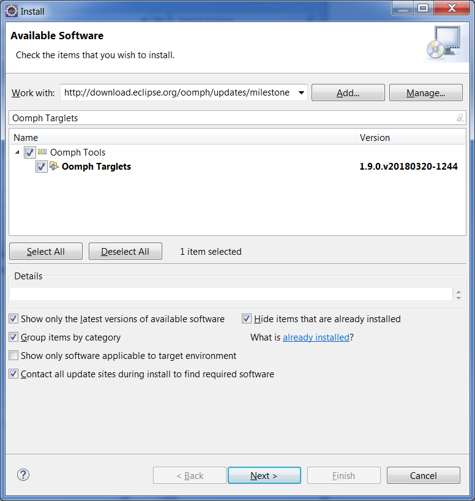

## Create an Empty Target Definition

Use `Window → Preferences... → Plug-in Development → Target Platform` to `Add...` a new Target Platform.

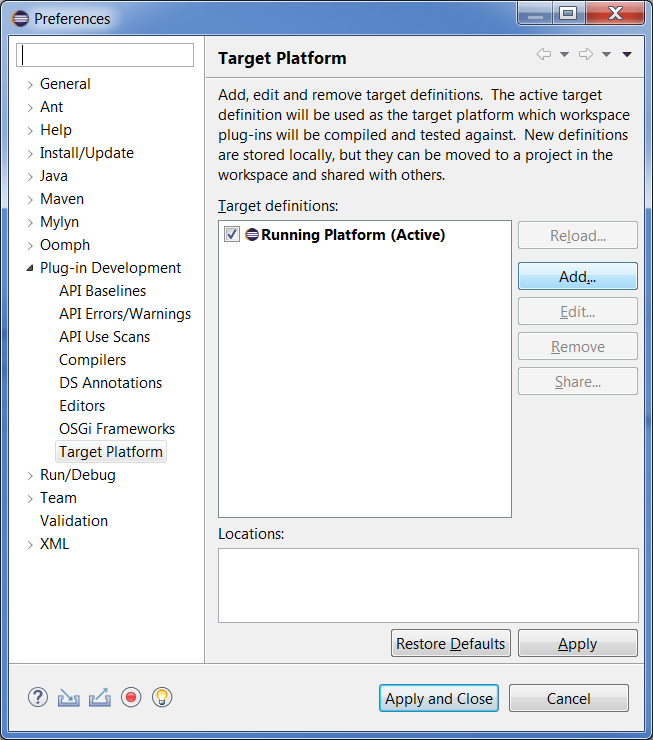

Choose `Nothing: Start with an empty target definition` and press `Next`.

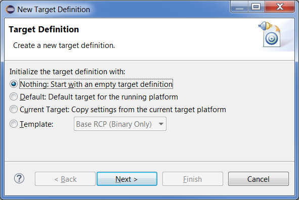

Use the `Name:` text field to name it `Sample` and press `Add...` to add a target location.

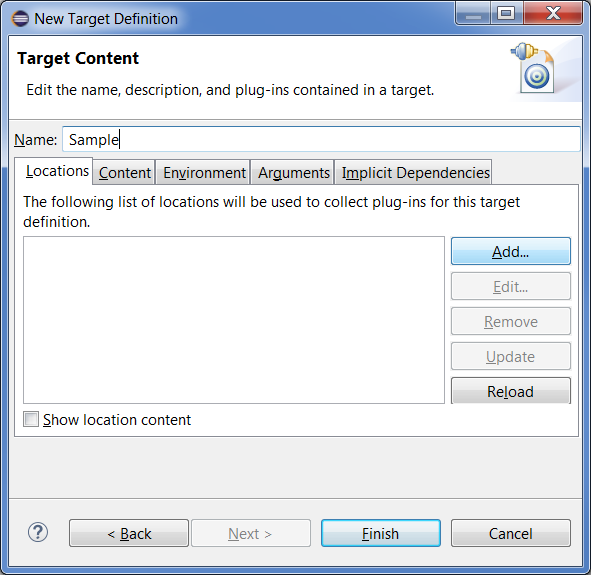

## Add a Targlet Container

In the `Add Content` dialog select `Targlet Container` and press `Next`.

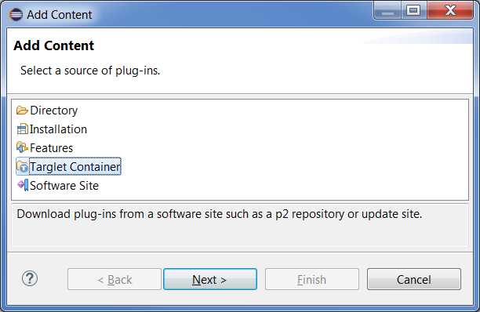

Use the `Targlet Container ID:` field to enter the name `Sample Targlet Container` and press `Finish`.

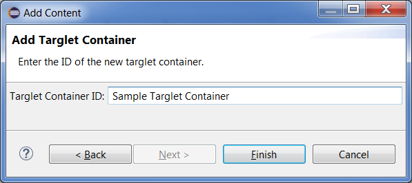

Select the new Targlet Container and press `Edit...` to edit it:

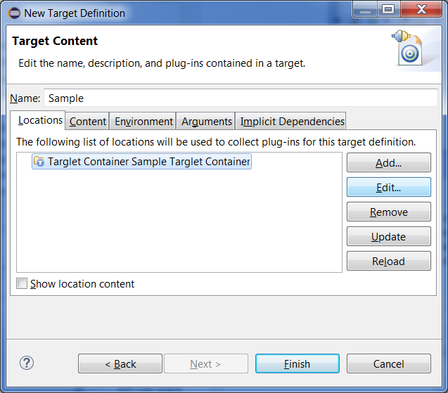

This will save the target definition, dismiss the dialog, and open the `Targlet Editor`.

## Edit Targlet Container with Targlet Editor

The Targlet Editor works well in combination with the Properties view and Oomph's Repository Explorer.
You can open the Properties view from the Targlet Editor's context menu or by double clicking any item in the editor.
You can open the Repository Explorer by entering `Repository Explorer` in the `Quick Access / Search` field to the left of the perspective toolbar in the upper right corner of the perspective.

Double click the root item (only item, currently) in the Targlet Editor and use the context menu to invoke `New Child → Targlet`.

The new Targlet must have a name.
The editor decorates errors in the tree and in the Properties view.
Use the Properties view to set the `Name` property to `Eclipse SDK`.

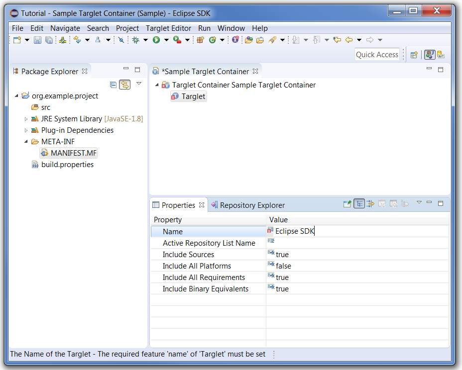

Use the context menu on the new Targlet named `Eclipse SDK` to invoke `New Child → Repository List`
and then use the context menu again to invoke `New Child → Repository`.
A Repository must of course specify a URL for a p2 update site.
Use the properties view to enter the URL [http://download.eclipse.org/eclipse/updates/I-builds](http://download.eclipse.org/eclipse/updates/I-builds).
Open the Repository Explorer view and then drag the Repository item and drop it onto the Repository combo in the Repository Explorer.

The Repository Explorer will load the p2 repository and display its contents, much like what you're familiar from using the `Help → Install New Software...` dialog.

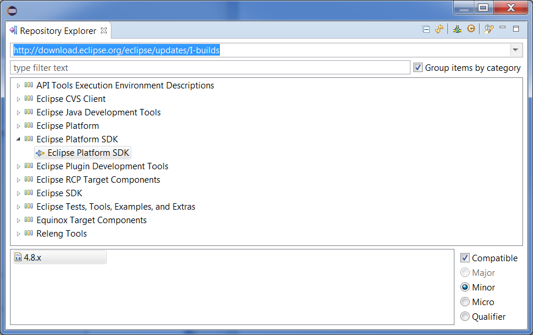

For each item you select, you can see which Versions of that item are available in the p2 repository.
You can alter how the Versions are displayed using the controls in the bottom right.
Here `Compatible` is checked, and `Minor` is selected.
You can drag any item, including the Version items, to the `Eclipse SDK` Targlet to create a Requirement.
When dragging a Version item, the version range of the Requirement that's created in the Targlet will reflect the display settings you've chosen.
Here is the result of dragging the "4.8.x" version item to the `Eclipse SDK` Target with the new Requirement selected to display its properties in the Properties view:

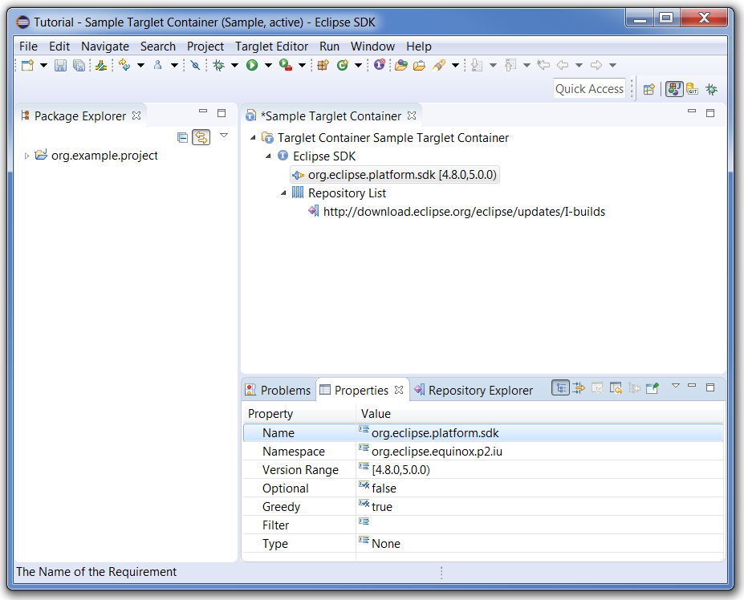

It is significant to note some of the differences between editing a Targlet Container with Oomph's Targlet Editor versus editing a *.target file PDE's Target editor.
At this point, we have not downloaded any artifacts from the p2 repository,
we've only explored the content metadata and we could author the complete definition based on just that information.
Also, editing PDE's Software Site container is achieved by specifying so-called installable units, either with an exact version or with the so called omni-version,
but Targlets use Requirements that can specify version ranges, and properties such as optional and greedy,
exactly like what you're able to express in a plug-in's `MANIFEST.MF`.
Requirements are a more expressive mechanism for expressing dependencies for the target platform.

When you save the Targlet Editor's contents, the Targlet Container will resolve in the background.
You can use `Window → Preferences → Plug-in Development → Target Platform` to make the `Sample` target platform the active target platform.

## Using a Source Locator

Suppose some of your projects in the workspace still have dependencies that aren't satisfied.

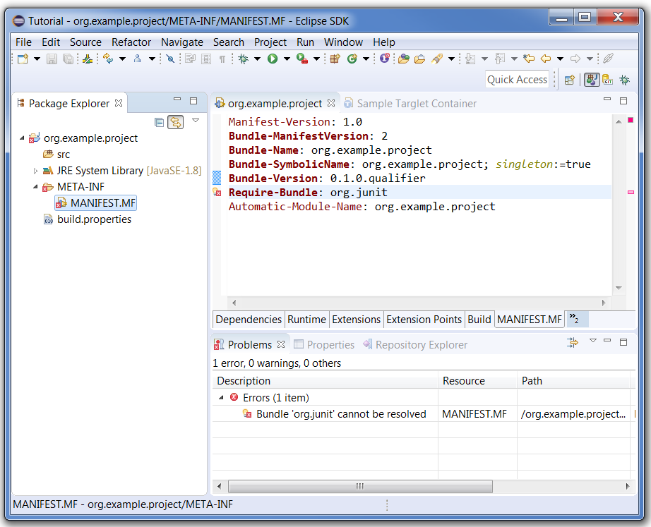

You can of course hunt for them in the Repository Explorer,
assuming you know in which p2 repo to find them.
If you don't know the p2 repository, but you expect it's in some repository hosted by Eclipse,
you can use [Eclipse Repository Search](Authoring_Guide.md#find-an-eclipse-p2-repository-with-the-repository-explorer) to find the p2 repository.
Once you know the repository, can you of course browse the contents and use drag and drop to create the necessary Requirements and to add the necessary Repository to a Repository List.

Oomph's Targlet framework supports another powerful mechanism, namely Source Locators.
The basic concept is that the underlying p2 framework is able to publish p2 metadata from source projects.
PDE's implementation reuses this to build a representation of the plug-ins and features in the workspace.
Oomph's Targlet framework reuses the same technology to induce a logical p2 repository from projects in the file system.
For example, you can use the Repository Explorer to browse all your workspace projects as a logical p2 repository.
Select `platform:/resource/` in the Repository Explorer's URL combo and switch to `Expert Mode` using the view's toolbar button with that hover text:

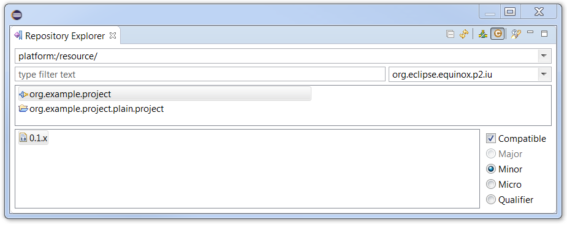

To exploit the use of a Source Locator feature, use the Targlet Editor to create another Targlet named `Workspace Dependencies`,
create a new Requirement in that new Targlet,
and use the Properties view to change the `Name` to `*`;
this is a so-called wildcard Requirement.
Then create a Source Locator in that new Targlet and use the Properties view to set the "Root Folder" to `platform:/resource/`;
this too is effectively a wildcard that denotes the file system location of each project in the workspace.
The result looks like this:

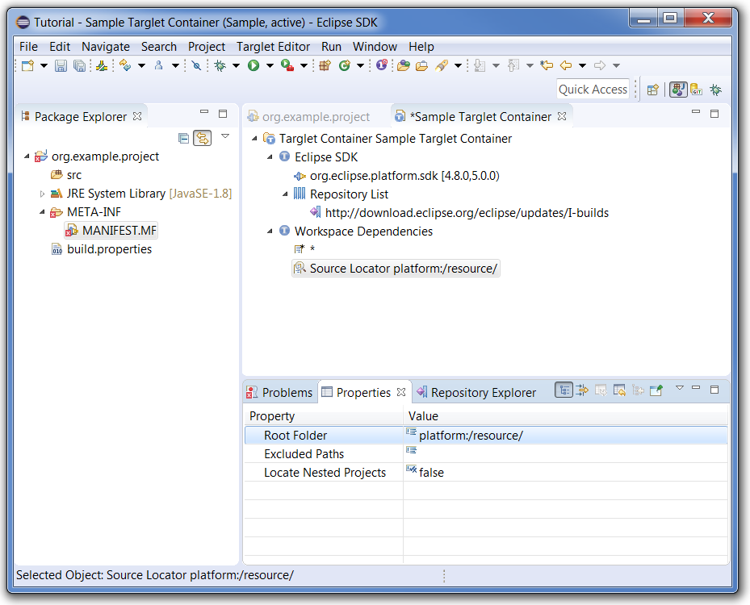

Assuming you've made the `Sample` target definition the active definition from the previous steps in this tutorial,
saving the Targlet Editor will resolve the target platform,
taking into account the dependencies of all projects in your workspace.
Because the Platform's I-builds include the `org.junit` bundle, after the resolution, the workspace error is eliminated because the target platform will contain the required bundle.

This is just a simple though useful example of using a Source Locator.
It should be evident that authoring a target platform in this manner is significantly simpler
because you need not replicate/repeat in the target platform definition,
the dependencies already expressed in your projects.
Another highly useful aspect not illustrated by this simple example is that you can use a Source Locator to point at a Git clone in your local file system.
During resolution, not only will all the requirements of the projects in that Git clone be resolved,
the projects themselves will be imported into the workspace! 
