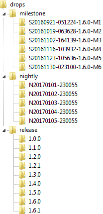

# Overview

The [Oomph Project](https://www.eclipse.org/oomph) is dedicated to providing extensions to the Eclipse Platform that improve the user experience.

One of Oomph's showcase technologies is the [Eclipse Installer](Eclipse_Installer.md "Eclipse Installer").
The installer exploits Oomph's flexible and powerful [setup engine](Authoring_Guide.md#understanding-the-setup-engine)
to automate the installation of applications as well as the provisioning of workspaces.
For an overview of this technology in action on a very large useful example,
have a look at the instructions for [Provisioning the Platform SDK](Eclipse_Platform_SDK_Provisioning.md "Eclipse Platform SDK Provisioning")
which creates a dedicated installation for working the source code of all projects that comprise the [Eclipse Platform's SDK](https://eclipse.dev/eclipse/).

Note that the latest version of the installer supports [installing Marketplace listings](Eclipse_Installer_Marketplace.md#Apply_a_Marketplace_Listing).


# Eclipse Installer

The [Eclipse Installer](Eclipse_Installer.md "Eclipse Installer") can be used to create specialized installations and to provision customized workspaces.


# Update Sites

We offer three types of drops: release, milestone, and nightly.
They can be found in these composite repositories:

* [http://download.eclipse.org/oomph/updates/release](http://download.eclipse.org/oomph/updates/release)
* [http://download.eclipse.org/oomph/updates/milestone](http://download.eclipse.org/oomph/updates/milestone)
* [http://download.eclipse.org/oomph/updates/nightly](http://download.eclipse.org/oomph/updates/nightly)

The following is a composite of the three above composites:

* [http://download.eclipse.org/oomph/updates](http://download.eclipse.org/oomph/updates)

For each of the four composite repos we offer a smaller variant that contains only the latest drop:

* [http://download.eclipse.org/oomph/updates/release/latest](http://download.eclipse.org/oomph/updates/release/latest) (contains only the latest release build)
* [http://download.eclipse.org/oomph/updates/milestone/latest](http://download.eclipse.org/oomph/updates/milestone/latest) (contains only the latest milestone build)
* [http://download.eclipse.org/oomph/updates/nightly/latest](http://download.eclipse.org/oomph/updates/nightly/latest) (contains only the latest nightly build)
* [http://download.eclipse.org/oomph/updates/latest](http://download.eclipse.org/oomph/updates/latest) (contains only the latest build)

The single drops are individually available under **[http://download.eclipse.org/oomph/drops](http://download.eclipse.org/oomph/drops)** as follows:



Note that at most five nightly drops are kept and that milestone drops are only kept until shortly after the next release cycle.


# Authoring Setup Models

Please see he [Authoring Guide](Authoring_Guide.md) for details.


# Useful Extensions

The following technologies are supported by Oomph:

* [Targlets](Targlets.md)
  provide a more expressive, flexible, scalable, and reliable infrastructure for defining a target platform.
* [Dynamic Working Sets](Dynamic_Working_Sets.md)
  provide the ability to create project working sets based on flexible predicates (rules) for specifying which projects should be in each particular working set.
* [Repository Analyzer](Repository_Analyzer.md)
  provides support for generating a web page with a detailed analysis of one or more p2 repositories.


# Questions

Learn from the [authoring tips and tricks](Authoring_Guide.md#tips-and-tricks),
visit our [help center](http://download.eclipse.org/oomph/help),
or search the [discussions](https://github.com/orgs/eclipse-oomph/discussions).

Many questions have been asked on the older forum.
Use the following so [search for your question](https://www.google.com/search?q=site%3Ahttps%3A%2F%2Fwww.eclipse.org%2Fforums+oomph):
```
site:https://www.eclipse.org/forums oomph
```


# Getting in Touch

First browse the [discussions](https://github.com/orgs/eclipse-oomph/discussions) to see if your question has already been answered.

As a **user** you should post your questions and comments to the public discussions:

* [https://github.com/orgs/eclipse-oomph/discussions](https://github.com/orgs/eclipse-oomph/discussions).

You can also monitor the **developer** mailing list or discuss development topics:

* Archive: [https://dev.eclipse.org/mhonarc/lists/oomph-dev](https://dev.eclipse.org/mhonarc/lists/oomph-dev)
* Mail: [mailto:oomph-dev@eclipse.org](mailto:oomph-dev@eclipse.org)

If you encounter **bug** or miss a **feature** please:

* Search the existing [issues](https://github.com/eclipse-oomph/oomph/issues) to avoid duplication.
* Submit a new [issue](https://github.com/eclipse-oomph/oomph/issues);
  please do not use issues to ask question,
  use [discussions](https://github.com/orgs/eclipse-oomph/discussions).


# Contributing to Oomph

Please read the [Contributor Guide](Contribution_Guide.md) for details.


# Tutorials

* [Provisioning the Platform SDK](Eclipse_Platform_SDK_Provisioning.md "Eclipse Platform SDK Provisioning")
* [Oomph Basic Tutorial](http://eclipsesource.com/blogs/tutorials/oomph-basic-tutorial/) by Jonas Helming (December 2016)
* [Oomph setup for Xtext projects](http://www.lorenzobettini.it/2015/10/oomph-setup-for-xtext-projects) by Lorenzo Bettini (October 10th, 2015)
* [Oomph Workshop: Eclipse the Way You Want It](http://thegordian.blogspot.de/2015/06/oomph-workshop-eclipse-way-you-want-it.html) by Eike Stepper (June 21st, 2015)
* [Using the New Eclipse Installer](http://www.lorenzobettini.it/2015/05/using-the-new-eclipse-installer) by Lorenzo Bettini (May 11th, 2015)
* [Walk-Through with Many Examples](http://github.com/joergreichert/oomph-catalogue) by Joeg Reichert (March 22nd, 2015)
* [How to configure Mylyn Task Queries for an Atlassian JIRA Connector with Oomph Installer](http://community.bonitasoft.com/blog/how-configure-mylyn-task-queries-atlassian-jira-connector-oomph-installer) by Aurelien Pupier (September, 2014)
* [Creating Custom Installations with Oomph](http://www.winklerweb.net/index.php/blog/12-eclipse/20-creating-custom-installations-with-oomph) by Stefan Winkler (April 1st, 2014)


# Articles

* [Top 10 Eclipse Mars Features](http://eclipsesource.com/blogs/2015/06/24/top-10-eclipse-mars-features) by Ian Bull (June 24th, 2015)
* [Using Oomph's bleeding-edge nightly builds](http://blog2.vorburger.ch/2015/06/using-oomphs-bleeding-edge-nightly.html) by Michael Vorburger (June 2015)
* [Eclipse Installer avec Oomph](http://gradot.wordpress.com/2015/06/01/eclipse-installer-avec-oomph) by Pierre Gradot (June 1st, 2015)
* [Install Eclipse Projects with a lot more Oomph](http://www.infoq.com/news/2015/03/eclipse-oomph) by Alex Blewitt (March 21st, 2015)
* [Oomph: A Matter of Preference](https://www.eclipse.org/community/eclipse_newsletter/2014/november/article2.php) by Ed Merks (November 2014)
* [Eclipse has Oomph](https://www.eclipse.org/community/eclipse_newsletter/2014/may/article3.php) by Eike Stepper (May 2014)
* [Shoes for the Shoemaker](http://ed-merks.blogspot.fr/2014/02/shoes-for-shoemaker.html) by Ed Merks (February 14th, 2014)
* [Eclipse Oomph bringt Schwung ins Projekt](http://jaxenter.de/eclipse-oomph-bringt-schwung-ins-projekt-12977) by Eike Stepper (June 26th, 2014)


# Videos

* [OpenDaylight Mini Summit recording of an Oopmh related presentation (June 2016)](https://www.youtube.com/watch?v=TU1zjytlwFE) Slides from this session are also available [on slideshare (faster)](http://www.slideshare.net/mikervorburger/opendaylight-developers-experience-15-eclipse-setup-hot-reload-future-plans) and [on GDocs in better quality](https://docs.google.com/presentation/d/14yLzog3OhIlVsk7Clr0Tff1YayRcFnQCUZqxHMWxiNI/)
* [OpenDaylight.org has Oomph, Eclipse.org Installer for automated workspace provisioning (April 2016)](https://www.youtube.com/watch?v=BLW8aOh6WeQ)
* [Oomph: Eclipse the Way You Want It](http://www.youtube.com/watch?v=a3h76AQQKN0) a speaker pitch video for the EclipseCon France (June 2015)
* [Interview with Eike Stepper on the Eclipse Oomph project](http://www.infoq.com/interviews/eike-stepper-eclipse-oomph-project) by Alex Blewitt (May 27th, 2015)
* [Oomph: Eclipse the Way You Want It](http://www.infoq.com/presentations/oomph) session recording and slides from the EclipseCon North America (May 21st, 2015)
* [Papyrus Oomph Model Refinements](http://www.youtube.com/watch?v=M6ZnL2mO88Q) by Christian Damus (July 8th, 2014)
* [Provisioning a Papyrus Development IDE with Oomph](http://www.youtube.com/watch?v=hgKjzr2pXzI) by Christian Damus (July 6th, 2014)
* [Oomph: Automatically Provision a Project-specific IDE](http://www.youtube.com/watch?v=_QlSosecEUo&list=UUej18QqbZDxuYxyERPgs2Fw) a video recording of the talk at the EclipseCon France (June 2014)

